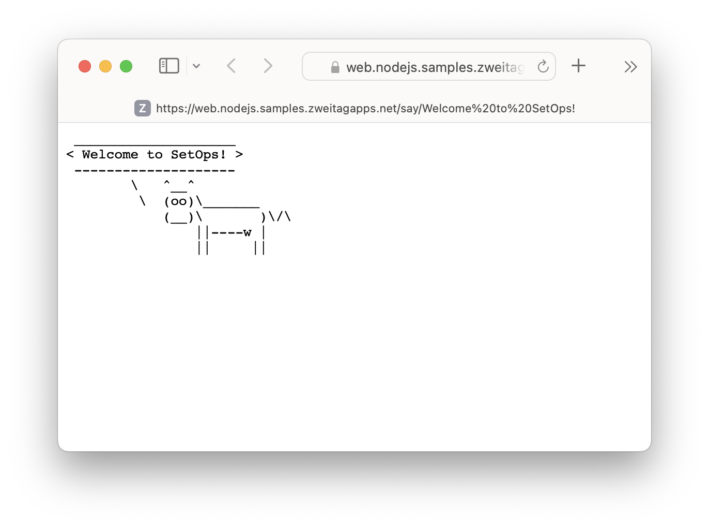

# sample-app-nodejs

A sample app for [SetOps](https://setops.co) built with [Node.js](https://nodejs.dev).

Beware, this app has super-cow powers! :cow:

The app is [deployed on SetOps](https://web.nodejs.samples.zweitagapps.net) with GitHub Actions from this repository: [check out the deployment workflow](.github/workflows/deploy.yml)!

If you want to deploy the app yourself, use the image referenced below. Apps created from a SetOps stage template use this image, too.

```
docker pull ghcr.io/setopsco/sample-app-nodejs:latest
```



## What to try

1. Deploy the app as a sample app from the SetOps Web UI. You can select it from the list of sample apps when you create a stage.

1. Wait until the stage is created and the progress bar disappears. Click on the stage and select the *web* app.

1. Make yourself comfortable with the app status dashboard and the information it tells you about the current state of your app.

1. Install the [SetOps CLI](https://docs.setops.co/latest/user/installation/) and [create an environment variable](https://docs.setops.co/latest/user/configuration/apps/#set-an-environment-variable) called `DEFAULT_MESSAGE`. The app will respond with whatever value you set this variable to.

## Components

* **App:** There is one SetOps app: *web*.

  The web app is built with the [Express](https://expressjs.com) web framework. There is not much to it – for every request to the
  `/say/:text` route, it will transform the text into a [cowsay](https://github.com/piuccio/cowsay) ASCII art image. It also prints it to the console,
  so you can enjoy the result in the SetOps logs feature, too.

* **Services:** The app is stateless. Thus, it does not use any service.

## Creating the app

> **Note**
> These are the steps you need to follow to manually create the app in SetOps. You can use a stage template on the web UI to do this in one step.

1. Create the stage: `setops -p samples stage:create nodejs`

1. Create the app: `setops -p samples -s nodejs app:create web`

1. Configure the app:

   ```
   setops -p samples -s nodejs --app web container:set health-check -- /bin/sh -c 'curl -s http://localhost:$PORT/.well-known/health-check | grep ok'
   setops -p samples -s nodejs --app web network:set health-check-path /.well-known/health-check
   setops -p samples -s nodejs --app web network:set public true
   setops -p samples -s nodejs --app web resource:set cpu 128
   setops -p samples -s nodejs --app web resource:set memory 128
   setops -p samples -s nodejs changeset:commit
   ```

1. Push the Docker image and activate the release:

   ```
   docker pull ghcr.io/setopsco/sample-app-nodejs:latest
   docker tag ghcr.io/setopsco/sample-app-nodejs api.setops.co/demo/samples/nodejs/web:latest
   docker push api.setops.co/demo/samples/nodejs/web:latest
   # note the sha256:[...] digest after pushing the image and paste it in "release:create"
   setops -p samples -s nodejs --app web release:create sha256:3899c519fe3d4ac08ef24bcca1ae7c1c5474f0448f474811f1c3cbda7229a0e4
   setops -p samples -s nodejs --app web release:activate 1
   setops -p samples -s nodejs changeset:commit
   ```

1. Open your app! :tada:
